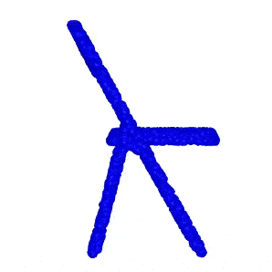
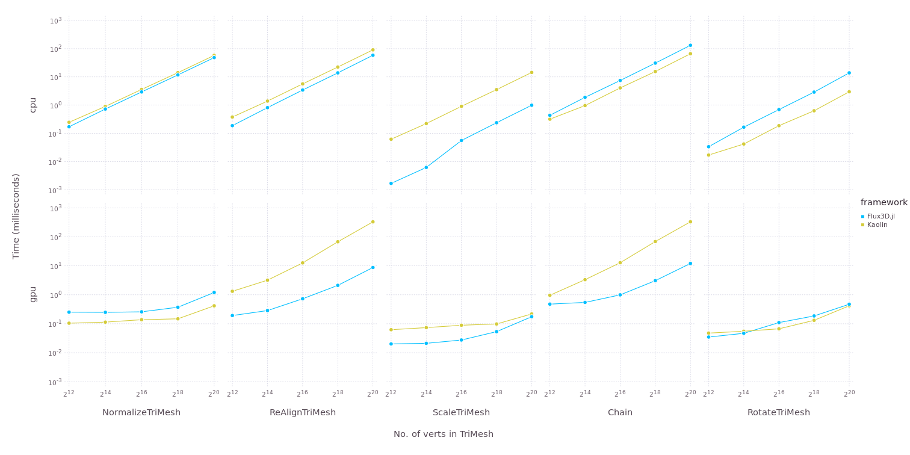
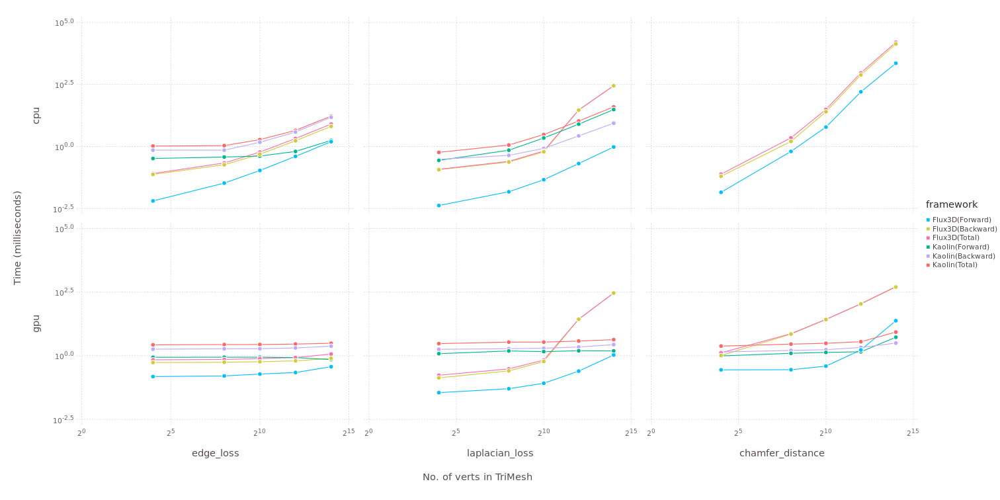

<p align="center">
  
</p>
<p>
<h1 align="center">Flux3D.jl</h1>
</p>

<p align="center">
  <a href="https://fluxml.ai/Flux3D.jl/dev" alt="Dev">
    
  </a>
  <a href="https://fluxml.ai/Flux3D.jl/stable" alt="Dev">
    
  </a>
  <a href="https://github.com/FluxML/Flux3D.jl/actions" alt="Build Status">
    
  </a>
  <a href="https://buildkite.com/julialang/flux3d-dot-jl" alt="BuildKite Build Status">
    
  </a>
  <a href="https://codecov.io/gh/FluxML/Flux3D.jl" alt="Codecov">
    
  </a>
  <a href="https://github.com/SciML/ColPrac" alt="ColPrac: Contributor's Guide on Collaborative Practices for Community Packages">
    
  </a>
</p>
<br/>

Flux3D.jl is a 3D vision library, written completely in Julia. This package utilizes [Flux.jl](https://github.com/FluxML/Flux.jl) and [Zygote.jl](https://github.com/FluxML/Zygote.jl) as its building blocks for training 3D vision models and for supporting differentiation. This package also have support of CUDA GPU acceleration with [CUDA.jl](https://github.com/JuliaGPU/CUDA.jl).The primary motivation for this library is to provide:

* Batched Data structure for 3D data like PointCloud, TriMesh and VoxelGrid for storing and computation.
* Transforms and general utilities for processing 3D structures.
* Metrics for defining loss objectives and predefined 3D models.
* Easy access to loading and pre-processing standard 3D datasets.
* Visualization utilities for PointCloud, TriMesh and VoxelGrid.
* Inter-Conversion between different 3D structures.

Any suggestions, issues and pull requests are most welcome.

<p align="center">
    
</p>

## Installation

This package is stable enough for use in 3D Machine Learning Research. It has been registered. To install the latest release, type the following in the Julia 1.6+ prompt.

```julia
julia> ]
(v1.6) pkg> add Flux3D
```

To install the master branch type the following

```julia
julia> ]
(v1.6) pkg> add Flux3D#master
```

## Examples

<div align="center">
  <table>
    <tr>
      <th style="text-align:center">
        <a href="https://fluxml.ai/Flux3D.jl/dev/tutorials/pointnet">PointNet Classfication</a>
      </th>
      <th style="text-align:center">
        <a href="https://fluxml.ai/Flux3D.jl/dev/tutorials/dgcnn">DGCNN Classification</a>
      </th>
      <th style="text-align:center">
        <a href="https://fluxml.ai/Flux3D.jl/dev/tutorials/fit_mesh">Supervised 3D reconstruction</a>
      </th>
    </tr>
    <tr>
      <td align="center">
        <a href="https://fluxml.ai/Flux3D.jl/dev/tutorials/pointnet">
          
        </a>
      </td>
      <td align="center">
        <a href="https://fluxml.ai/Flux3D.jl/dev/tutorials/dgcnn">
          
        </a>
      </td>
      <td align="center">
        <a href="https://fluxml.ai/Flux3D.jl/dev/tutorials/fit_mesh">
          
        </a>
      </td>
    </tr>
  </table>
</div>


## Usage Examples

```julia

julia> using Flux3D

julia> m = load_trimesh("teapot.obj") |> gpu
TriMesh{Float32, UInt32, CUDA.CuArray} Structure:
    Batch size: 1
    Max verts: 1202
    Max faces: 2256
    offset: -1
    Storage type: CUDA.CuArray

julia> laplacian_loss(m)
0.05888283f0

julia> compute_verts_normals_packed(m)
3×1202 CUDA.CuArray{Float32,2,Nothing}:
  0.00974202   0.00940375   0.0171322   …   0.841262   0.777704   0.812894
 -0.999953    -0.999953    -0.999848       -0.508064  -0.607522  -0.557358
  6.14616f-6   0.00249814  -0.00317568     -0.184795  -0.161533  -0.168985

julia> new_m = Flux3D.normalize(m)
TriMesh{Float32, UInt32, CUDA.CuArray} Structure:
    Batch size: 1
    Max verts: 1202
    Max faces: 2256
    offset: -1
    Storage type: CUDA.CuArray

julia> save_trimesh("normalized_teapot.obj", new_m)
```

## Citation

If you use this software as a part of your research or teaching, please cite this GitHub repository. For convenience, we have also provided the BibTeX entry in the form of `CITATION.bib` file.

```
@misc{Suthar2020,
    author = {Nirmal Suthar, Avik Pal, Dhairya Gandhi},
    title = {Flux3D: A Framework for 3D Deep Learning in Julia},
    year = {2020},
    publisher = {GitHub},
    journal = {GitHub repository},
    howpublished = {\url{https://github.com/FluxML/Flux3D.jl}},
}
```

## Benchmarks

### PointCloud Transforms (Flux3D.jl and Kaolin)


### TriMesh Transforms (Flux3D.jl and Kaolin)


### Metrics (Flux3D.jl and Kaolin)


## Current Roadmap

- [X] Add Batched Structure for PointCloud and TriMesh.
- [X] Add Transforms/Metrics for PointCloud and TriMesh.
- [X] GPU Support using CUDA.jl
- [X] Add Dataset support for ModelNet10/40.
- [X] Add Batched 3D structure and Transform for Voxels.
- [X] Interconversion between different 3D structures like PointCloud, Voxel and TriMesh.
- [ ] Add more metrics for TriMesh (like normal_consistency and cloud_mesh_distance)
