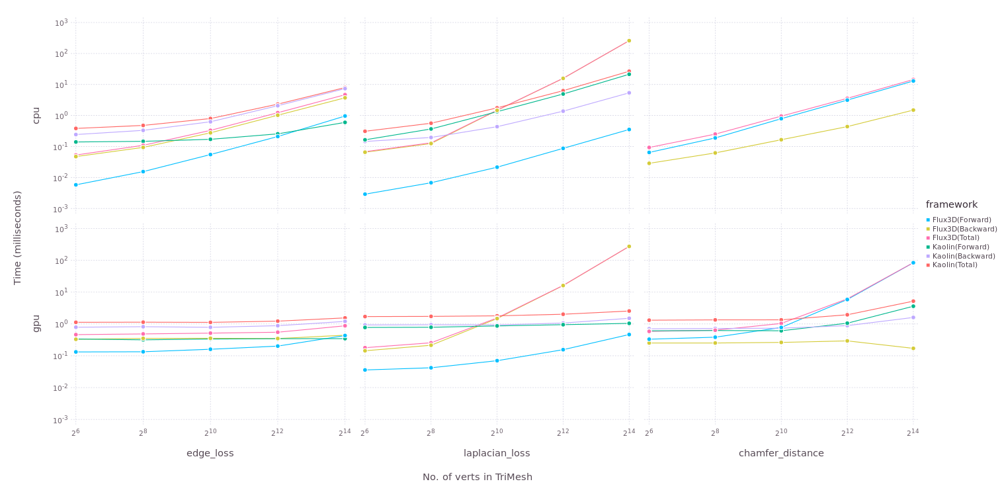

<p align="center">
  
</p>
<p>
<h1 align="center">Flux3D.jl</h1>
</p>

<p align="center">
  <a href="https://nirmal-suthar.github.io/Flux3D.jl/dev" alt="Dev">
    
  </a>
  <a href="https://github.com/nirmal-suthar/Flux3D.jl/actions" alt="Build Status">
    
  </a>
  <a href="https://gitlab.com/JuliaGPU/Flux3D-jl/commits/master" alt="Pipeline Status">
    
  </a>
  <a href="https://codecov.io/gh/nirmal-suthar/Flux3D.jl" alt="Codecov">
    
  </a>
</p>
<br/>

Flux3D.jl is a 3D vision library, written completely in Julia. This package utilizes [Flux.jl](github.com/FluxML/Flux.jl) and [Zygote.jl](github.com/FluxML/Zygote.jl) as its building blocks for training 3D vision models and for supporting differentiation. This package also have support of CUDA GPU acceleration with [CUDA.jl](github.com/JuliaGPU/CUDA.jl).The primary motivation for this library is to provide:

* Batched Data structure for 3D data like PointCloud and TriMesh for storing and computation.
* Transforms and general utilities for processing 3D structures.
* Metrics for defining loss objectives and predefined 3D models.
* Easy access to loading an pre-processing standard 3D datasets.
* Visualization utilities for PointCloud and TriMesh.

Any suggestions, issues and pull requests are most welcome.

## Installation

This package is under active development but we believe it is stable enough for use in 3D Machine Learning Research. It has been registered. To install the latest release, type the following in the Julia 1.3+ prompt.

```julia
julia> ] Flux3D
```

To install the master branch type the following

```julia
julia> ] Flux3D#master
```

## Examples

<div align="center">
  <table>
    <tr>
      <th style="text-align:center">
        <a href="https://nirmal-suthar.github.io/Flux3D.jl/dev/tutorials/pointnet">PointNet Classfication</a>
      </th>
      <th style="text-align:center">
        <a href="https://nirmal-suthar.github.io/Flux3D.jl/dev/tutorials/dgcnn">DGCNN Classification</a>
      </th>
      <th style="text-align:center">
        <a href="https://nirmal-suthar.github.io/Flux3D.jl/dev/tutorials/fit_mesh">Supervised 3D recontruction</a>
      </th>
    </tr>
    <tr>
      <td align="center">
        <a href="https://nirmal-suthar.github.io/Flux3D.jl/dev/tutorials/pointnet">
          
        </a>
      </td>
      <td align="center">
        <a href="https://nirmal-suthar.github.io/Flux3D.jl/dev/tutorials/dgcnn">
          
        </a>
      </td>
      <td align="center">
        <a href="https://nirmal-suthar.github.io/Flux3D.jl/dev/tutorials/fit_mesh">
          
        </a>
      </td>
    </tr>
  </table>
</div>


## Usage Examples

```julia

julia> using Flux3D

julia> m = load_trimesh("teapot.obj") |> gpu
TriMesh{Float32, UInt32, CUDA.CuArray} Structure:
    Batch size: 1
    Max verts: 1202
    Max faces: 2256
    offset: -1
    Storage type: CUDA.CuArray

julia> laplacian_loss(m)
0.05888283f0

julia> compute_verts_normals_packed(m)
3×1202 CUDA.CuArray{Float32,2,Nothing}:
  0.00974202   0.00940375   0.0171322   …   0.841262   0.777704   0.812894
 -0.999953    -0.999953    -0.999848       -0.508064  -0.607522  -0.557358
  6.14616f-6   0.00249814  -0.00317568     -0.184795  -0.161533  -0.168985

julia> new_m = Flux3D.normalize(m)
TriMesh{Float32, UInt32, CUDA.CuArray} Structure:
    Batch size: 1
    Max verts: 1202
    Max faces: 2256
    offset: -1
    Storage type: CUDA.CuArray

julia> save_trimesh("normalized_teapot.obj", new_m)
```

## Benchmarks

### PointCloud Transforms (Flux3D.jl and Kaolin)


### TriMesh Transforms (Flux3D.jl and Kaolin)


### Metrics (Flux3D.jl and Kaolin)


## Current Roadmap

- [X] Add Batched Structure for PointCloud and TriMesh.
- [X] Add Transforms/Metrics for PointCloud and TriMesh.
- [X] GPU Support using CUDA.jl
- [X] Add Dataset support for ModelNet10/40.
- [ ] Add Batched 3D structure and Transform for Voxels.
- [ ] Interconversion between different 3D structures like PointCloud, Voxel and TriMesh.
- [ ] Add more metrics for TriMesh (like normal_consistency and cloud_mesh_distance)
